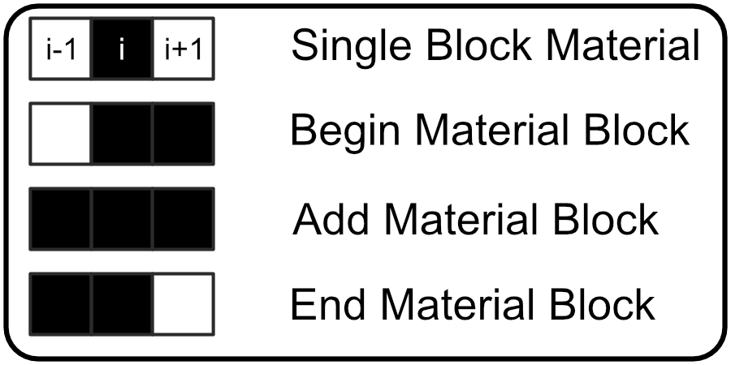
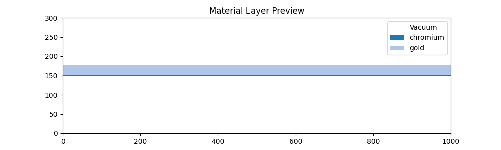

# Tutorial

In this tutorial I'll describe both how to use this geometry writer library and provide a description of how it works. I also provide a test program in the /Test directory which includes the relevant input files in the /Test/io directory in this tutorial I'll describe the algorithm in both fairly general terms and in the context of the included Testing environment. 

## Input and Output Files
Before we get started I'll briefly describe the required input files both in terms of what is included and the general format you
will need to follow in order for this library to work. 
### Testing Image
Below is the Input Image from the Included Testing Program of a material profile with a domain size of 500x500 pixels and a nanoantenna with two legs each with a width of 80 pixels and one 170 pixel leg and one 160 pixel leg. 


In general I recommend that when creating image files that you use a vector graphics program (I use Affinity Design which but
Inkscape is free and works for our purposes) and then export the image as a .png which the python image libarary I'm using plays
nicely with. The core algorithm of this library will convert an input image into a numpy array where each pixel is converted from an RGBA value to either a 0 if the RGB value is [255, 255, 255] and a 1 for all other colors. The alpha channel is presently not used for state conversion. So the image processor supports any non-white color as a valid input pixel I recommend using binary images for clarity. 

### pphinfoini.json
This library is meant to support University of Ottawa Compuational Nanophotonics Research Group's Internal 3D-FDTD software package so we take in the input file that is required to run those simulations but we are really only interested in the Domain Size (The Number of Cells in each direction), Step Size (Step Size in Each Direction), and Center Position (Where the center of the simulation domain is defined to be). We use the Domain Size for a layer visualization preview and to check that the input image size matches what the simulation is expecting and we use the Step Size when writing the output geometry.json file. 
```
   {
      "Domain Size": [500, 300, 500],
      "Domain Decomposition": [4, 4, 4],
      "Step Size": [1e-9, 1e-9, 1e-9],
      "PML Box": [20, 20, 20],
      "TFSF Box": [20, 20, 20],
      "Scattering Box": [10, 10, 10],
      "Total Box": [30, 30, 30],
      "Number of Time Steps": 10000,
      "Number of Wavelengths": 50,
      "Minimum Wavelength": 500e-09,
      "Maximum Wavelength": 1500e-09,
      "ANTENNA_TYPE": 1000,
      "Center Position": [250, 150, 250]
   }
```
More information on the pphinfoini.json and it's entry values you can read the Controls section of the 3D-FDTD tutorial documentation. 


### params.json
We can't actually determine all of the relevant information about for the geomtry.json file from the pphinfoini.json and input image files alone so this params.json file provides some supplemental information. The input image and the step size provide enough information to fill out information on the XZ plane but we also need to know where each geometry layer is placed in the propagation direction (Y in this case) so that information is held here. This library supports writing multiple materials to the geometry.json file so the MaterialImagePath parameter is used to define the specific location of each input image, if fewer images are provided thant materials of interest then each subsequent material image is assumed to be the same as the last image provided. The MaterialLabel parameter defines the material entry in the geometry.json file and it must match a material label that the 3D-FDTD software recognizes or the FDTD simulation will not run properly. The MaterialLayer defines where along the propagation axis a material layer will be placed and the MaterialThickness defines how many layers along the propagation axis that material layer will span.
```
   {
      "MaterialLayer":[164, 151.5],
      "MaterialThickness":[25, 3],
      "MaterialLabel":["gold", "chromium"],
      "MaterialImagePath":["io/TestShape.png", "io/TestShape.png", "io/TestShape.png"]
   }
```

### geometry.json
The goal of this library is to convert images corresponding to material layers into a geometry file that the 3D-FDTD code can recognize so I'll describe the relevant parts of the geometry.json files that are needed to understand what is being output by this libary.
```
[
   {
      "shape": "Rectangle",
		"radius":0,
		"length":1e-9,
		"width":1e-9,
		"thickness":1e-9,
		"material": "gold",
		"position":[500,150,500]
   }
]
```
We will be converting 2D images into a set of rectangles in the XZ plane where each rectangle corresponds to a single geometry.json entry. In the context of the geometry.json the length of the rectangle is the span along the Z-axis, the width is the span along the X-axis, and the thickenss is the span along the y-axis (this information is defined in the params.json input file) because each rectangle corresponds to a run of pixels that radius is set to 0 which corresponds to a rectangle with no rounding on the corners. The length, width, and thickness are defined in terms of the physical dimensions of the geometry controlled primarily by the simulation step size while the position is defined in terms of voxel coordinates and that distincion is preserved in this libary

At the end of running this library an output geometry.json file is generated with as many entries as there are continuous blocks of colored pixels along the x-axis in the input image where the height of the image should match the Z-coordinate of the domain and the width of the image should match the X-coordinate of the domain. 

## Material Detection Algorithm
The primary image processing of this libary is handled by the Image2GeometryEntryList() and rgba2state() functions and the process of storing information to later write to the geometry.json file the GeometryEntry() class is utilized

### getMaterialList()
```{eval-rst}
.. automodule:: fdtdgeometrywriter.Image2GeometryEntryList
   :members:
```

### rgba2state()
```{eval-rst}
.. automodule:: fdtdgeometrywriter.rgba2state
   :members:
```

### GeometryEntry()
```{eval-rst}
.. automodule:: fdtdgeometrywriter.GeometryEntry
   :members:
```

### State Vectors
A brief description of the state vector is given in the getMaterialList() documentation above but some more information is warranted for this tutorial. The Statement of what each state vector is summarized in the below image. 



The state vector is collected for each pixel in the input image (not including the left and right boundaries of the image). The state vector is a 3-bit binary number so there are eight possible states that a pixel can be in, but we are only interested in the four states provided above so I'll detail what each state means. 

#### 011 State - Begin Material Block
It's most intuitive to refer to entries to the geometry.json as material blocks since at this point we are dealing entirely in terms of how many pixels in an image are colored, if the current pixel has a 011 state vector which means that the previous pixel was white while the current and next pixel are colored then Image2GeometryEntryList() interprets this to mean that a material block has begun and is going to have more than one pixel in it so the coordinate is recorded to be used later to define the mid-point coordinate and a width counter is initialized to 1. 

#### 111 State - Add Material Block
If the current pixel has a 111 state vector which means that the previous, current, and next pixel are all colored so Image2GeometryEntryList() interprets that to mean that the current material block is not ending so the width counter is incremented and then the loop moves to the next pixel. 


#### 110 State - End Material Block
If the current pixel has a 110 state vector which means that the previous and current pixels are both colored and the next pixel will be white so Image2GeometryEntryList() interprets that to mean that this pixel is the last one in the current material block so the width counter is incremented and the current coordinate is recorded. Now all of the information about the material block has been gathered and a GeometryEntry object can be generated and appended to a list of gathered geometry entries. 

#### 010 State - Single Block Material
There is a special case that we should consider as well, when the current pixel is colored and bounded by white pixels, state 010. This is interpreted by Image2GeometryEntryList() to be a single pixel width material and is immediatedly converted to a GeometryEntry object and appened to the geometry entries list. 

## Writing GeometyEntry() Objects to A geometry.json File
At the end of Image2GeometryEntryList() the user is returned a list of GeometryEntry() objects so all that remains is to convert those objects into a geometry.json file that the 3D-FDTD software can recognize. There are two relevant functions for this process 
getEntry() and writeGeometry()

### getEntry()
```{eval-rst}
.. automodule:: fdtdgeometrywriter.getEntry
   :members:
```

The primary purpose of getEntry() is to convert GeometryEntry() object into a dictionary with the length, width, and thickness transformed from a pixel measurement into a distance in meters which is accomplished using the step size. It would likely work to just multiply the number of pixels by the step size in each direction but since the step size is generally quite small there is a risk of introducing a round off error to avoid this we convert the base and exponent of the step size into a string that appends to the end like a unit and multiply the coefficient by the pixel length. i.e. in the case a width of 5 pixels with a step size of 5E-9 instead of writing the result of '(5*5E-9)' directly to the file we extract the exponent, -9, and append a "E-9" string to the end of the entry and multiply the coefficient, 5, by the width to end up with '25"E-9"' at the end of the process we return a dictionary to write into the geometry.json file using the python json library in the next step.

### writeGeometry()
```{eval-rst}
.. automodule:: fdtdgeometrywriter.writeGeometry
   :members:
```

This function primarly just writes the output from getEntry() to a file but there is a little bit of housekeeping that occurs. First it needs to determine whether to make a new file for geometry.json or to clear an existing file, once the file handling is complete a the file is looped over all material layers writing each material entry for a layer to file stopping before writing the last entry which has some special handling. Each entry needs to be separated by a comma except for the final entry in the file and the entire list needs to be bounded by brackets, so at the last entry for a material a check verifies whether there is another material layer to enter or not and if there is then the last entry gets a comma appended which prevents the final entry of the file from having a comma appended. 


## Layer Visualization
In params.json layer placement and thickness values are provided for each material layer, but it's very easy to make a mistake when defining these values and quite frustrating to run a lengthy FDTD simulation just to find that these values are incorrectly defined so I've included a visualization function in this package as well so that before running the FDTD code the user can verify that materials have been placed where they are expected. 

### PreviewLayerPlacement()
```{eval-rst}
.. automodule:: fdtdgeometrywriter.PreviewLayerPlacement
   :members:
```

The provided testing code and files will yield the following layer preview image. 



## Example Library Usage
Though an example script has been provided I'll also provide a general layout for using this code here just in case there's a problem accessing that version.

```
import fdtdgeometrywriter as writer
params = writer.getParams("io/pphinfoini.json", "io/params.json")
writer.writeGeometry("io/geometry.json",params)
writer.PreviewLayerPlacement(params)
```

In this example script parameter files are read in, a geometry file is written, and the proposed layer placement preview image is generated for inspection, some additional features can be built on top of this to setup an all in one 3D-FDTD job submission script but for the purposes of demonstration these four lines are all that should be required to utilize this library externally so long as the path to fdtdgeometrywriter.py is included python's path. 